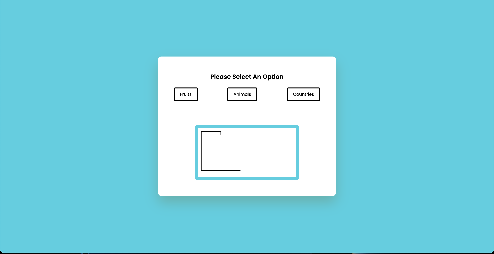

## Hangman-Game

Welcome to my Hangman Application

## Description
Hangman-Game is a simple word-guessing game built using HTML, CSS, and JavaScript. The game randomly selects a word from a pre-defined list and asks the player to guess the word by suggesting letters one at a time. The player has a limited number of guesses before the game ends.

## Installation
To play Hangman-Game, simply download or clone the repository to your local machine, and open the index.html file in a web browser.

## How to Play
Once you open the index.html file, the Hangman-Game will start automatically. You will see a blank space for each letter in the randomly selected word, and a keyboard with all the letters of the alphabet. To guess a letter, click on one of the letters.

## Contributors:
This application was created by Kevin Barraza.

## Questions:
For any inquiries, please refer to my GitHub page at https://github.com/eskevin14th. I will be happy to respond to any questions you may have.
